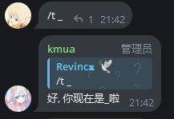
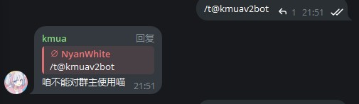
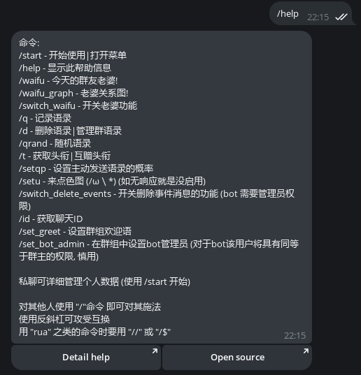
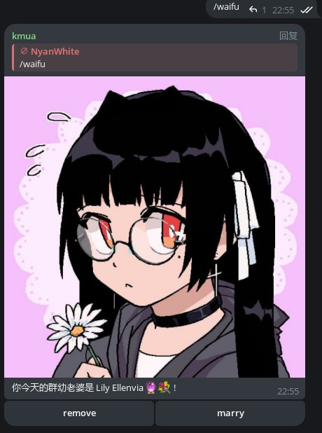
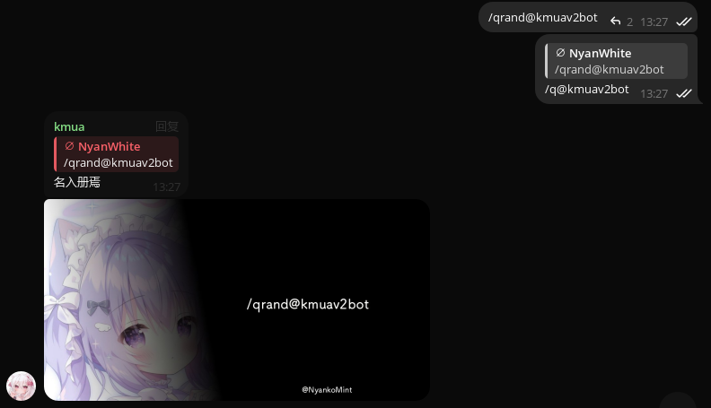
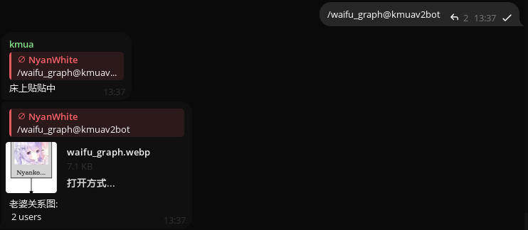
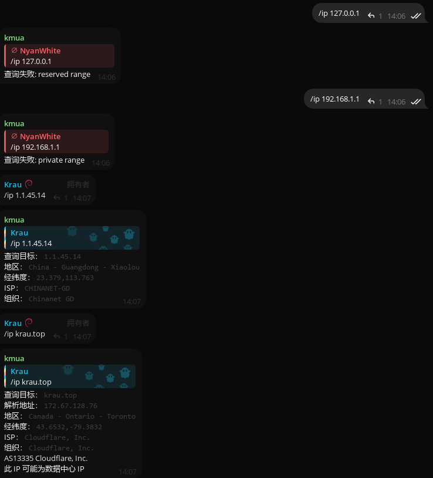
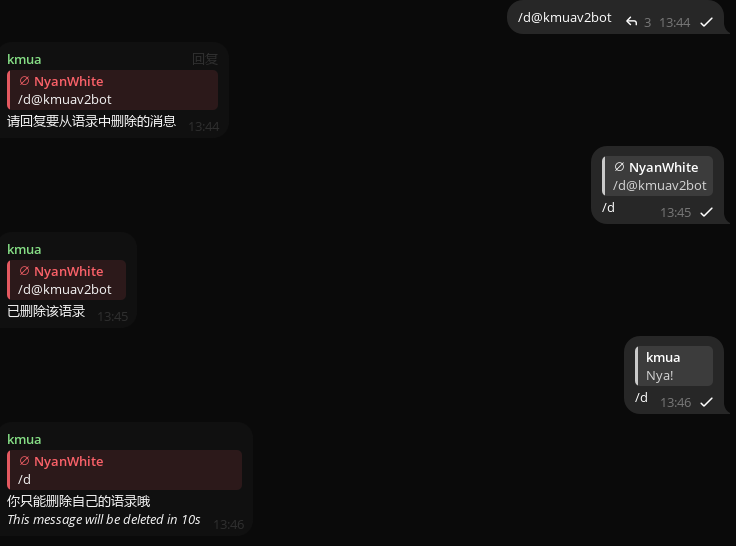
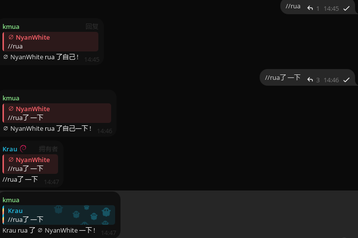

# 详细帮助

~~怎么没人帮窝写文档a~~

现在有了（

---

## 目前已知的支持用户组命令

使用右侧栏进行关于命令的细节查看

还有更多吗？

----

### /start

提供最初始的帮助菜单

开源仓库位置 完整的帮助

个人数据 以及被Quote的内容管理

抽老婆管理和一个Nya~

每一个小功能内非常简单这边就不加说明了（

---

### /t

常规格式：**/t 头衔内容**

* 简单快速易上手

但有一点要注意 这个功能在对群组所有者使用时是无效的

* 不仅可以用于自己 还能赋予他人 一般通过**回复 /t 内容**用法

---

### /setu

顾名思义 随机涩图 但是抽取范围有限 来源频道见按钮中的[Channel](https://t.me/manyacg)

左侧按钮即可打开图片来源

*这一项命令在私聊中似乎是无效的*

---

### /help 

生成一条带有所有命令的简要参数信息 帮助用户更快上手

左侧按钮可跳转至帮助页面 右侧则为开源仓库地址

即使在群内 本条消息生成的内容也无任何差别

* *使用如同Minecraft格式的 **/help <number>** 不影响任何输出*

---

### /q

用法和Quoty Bot是一样的 但不存在转发给bot时自动生成 对消息回复/q即可

在对所q消息置顶之后 kmua便会回复被/q的句子一句随机的应答语 并生成一张带有所q消息内容的图片

其实 即使不对消息进行回复 kmua也会贴心的回复你/q的正确用法

*请回复一条消息*

---

### /waifu

抽取群老婆！抽取后则本日内结果不变

左为移除右为结婚

---

### /id

*本部分无图例*

获取当前对话的ID和请求的用户ID 还可通过回复消息内容

获取消息发送者的ID（**回复 /id**）

或许有用处？

---

### /qrand

随机抽取语录进行发送（范围为整个群中）

在此前需要曾有已被记录的名言 否则将不进行任何输出

---

### /waifu_graph

渲染群内的waifu关系图 如果数量较多则需要较长的等待时间

此外 稍候的提示语是随机的 每一次均有不同

---

### /ip

简单易用易上手 /ip空格后接所需要请求的网址或ip

所请求的内容不需要带任何协议头 也就是例如 tg:// http:// https:// ftp:// localhost:32767

这些都不需要 只需后面的即可

e.g:/ip google.com

---

### /d

删除已有的语录记录

简单易上手 只需要回复需要删除的语录发送/d即可

该功能主要依靠消息发送者作为标记 便只能删除自己的语录

也就是如果自己把别人的消息存入语录中 自己是无法通过/d去删除的（非常重要）

但别人能够/d自己的消息移除语录

无论回复平常的消息亦或者是他人被记录的语录 均会回复 *只能删除自己的语录哦*

但如果处于管理员状态下 /d的作用域会扩大一些 略有不同 在下方的管理员命令里了解更多

---

### //rua   /$rua

为防止与别的命令互相冲突或是消息变命令而被过滤掉 

两//和/$依旧可以发出行为命令 任意内容都可

中文行为命令下不需要// 因为这并不会被标识为一条命令

//与/$的作用相同 且$不能使用别的符号进行代替否则将无效化

使用本命令需要对消息进行回复 或是只发送不回复 这样所指对象将是自己本身

未来将加入使用提及下的行为命令

*reply:* //<action> <addition>

<addition>为可选值 不输入并不影响

---

## 目前已知的管理组命令

---

### /setqp

---

### /switch_waifu

---

### /switch_delete_events

---

### /switch_unpin_channel_pin

---

### /set_greet

---

### /set_bot_admin

