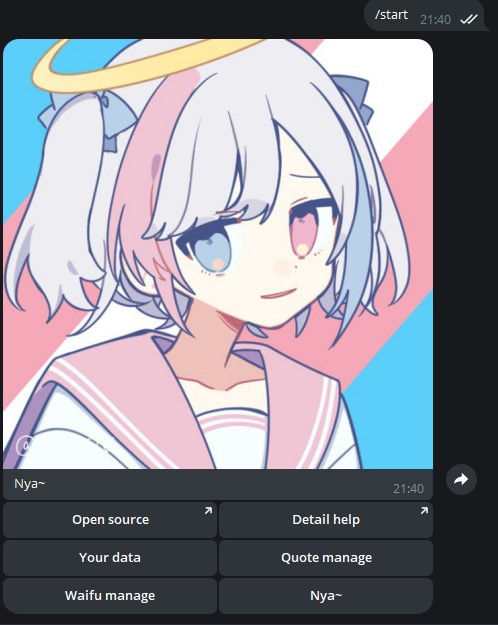
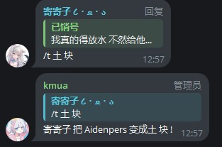
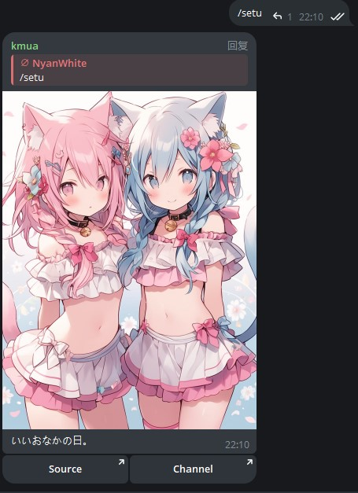
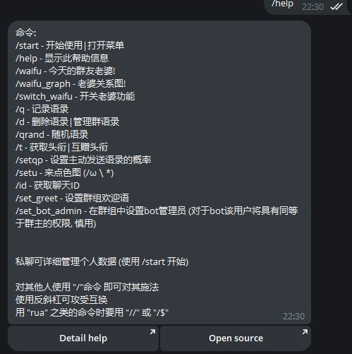
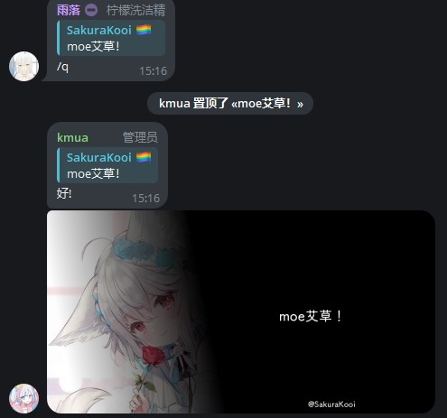

# 详细帮助

~~怎么没人帮窝写文档a~~

现在有了（

---

## 目前已知的支持用户组命令

| /start | /t   | /setu  | /help        | /q   |
| :----: | ---- | ------ | ------------ | ---- |
| /waifu | /id  | /qrand | /waifu_graph | /d   |
|   /    | \    | //rua  | /&rua        |      |
|        |      |        |              |      |

使用右侧栏进行关于命令的细节查看

还有更多吗？

----

### /start

提供最初始的帮助菜单

开源仓库位置 完整的帮助

个人数据 以及被Quote的内容管理

抽老婆管理和一个Nya~

每一个小功能内非常简单这边就不加说明了（

---

### /t

常规格式：**/t 头衔内容**

* 简单快速易上手

但有一点要注意 这个功能在对群组所有者使用时是无效的

* 不仅可以用于自己 还能赋予他人 一般通过**回复 /t 内容**用法

---

### /setu

顾名思义 随机涩图 但是抽取范围有限 来源频道见按钮中的[Channel](https://t.me/manyacg)

左侧按钮即可打开图片来源

*这一项命令在私聊中似乎是无效的*

---

### /help 

生成一条带有所有命令的简要参数信息 帮助用户更快上手

左侧按钮可跳转至帮助页面 右侧则为开源仓库地址

即使在群内 本条消息生成的内容也无任何差别

* *使用如同Minecraft格式的 **/help <number>** 不影响任何输出*

---

### /q

用法和Quoty Bot是一样的 但不存在转发给bot时自动生成

其用法为 **回复 /q**

在对所q消息置顶之后 kmua便会回复被/q的句子一句随机的应答语 并生成一张带有所q消息内容的图片

其实 即使不对消息进行回复 kmua也会贴心的回复你/q的正确用法

*请回复一条消息*

---

### /waifu

摸了 下次再写.jpg

---

## 目前已知的管理组命令

| /switch_waifu | /d   | /setqp | /set_greet | /set_bot_admin |
| :-----------: | ---- | ------ | ---------- | -------------- |