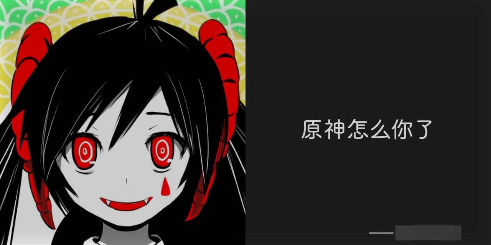
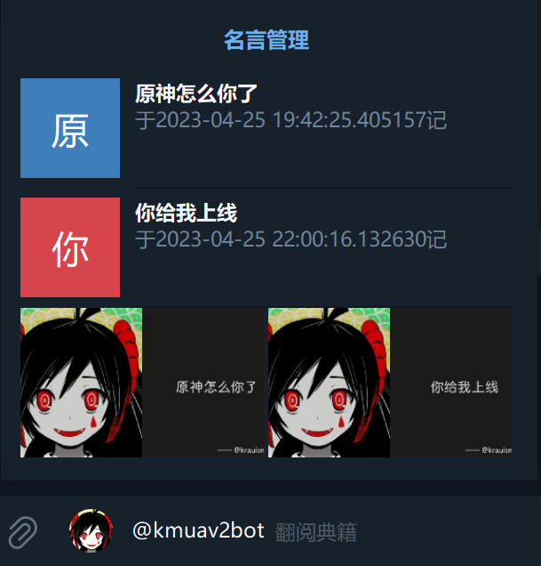
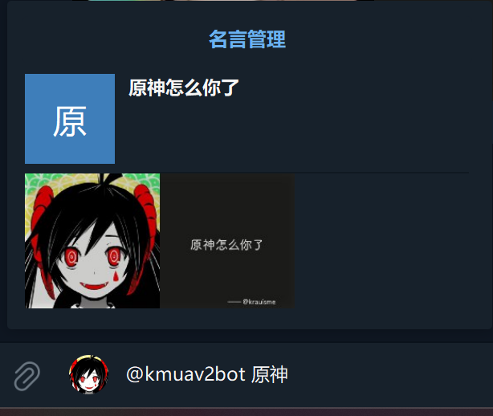
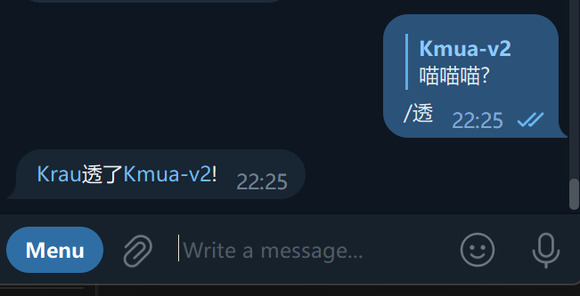
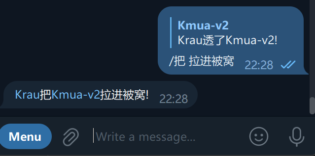
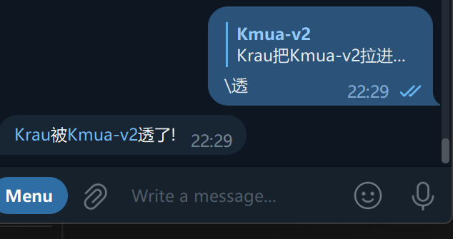
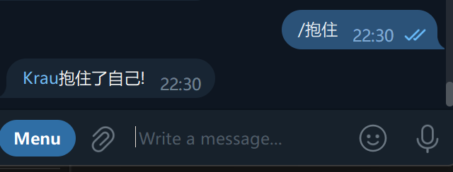
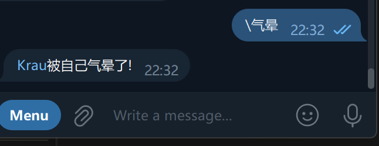
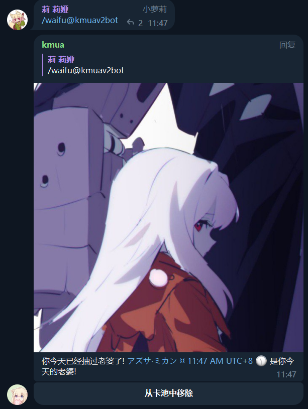

# 详细帮助

## 功能

- Quote(载入史册)
- 群内文字命令互动
- 获取群头衔/互赠头衔
- 不能好好说话!
- 关键词回复
- 今日老婆!
- 入群欢迎
- 开发中...

## 命令

| 命令              | 说明              |
| ----------------- | ----------------- |
| /help             | 显示帮助信息      |
| /start            | 开始使用          |
| /q                | 载入史册          |
| /d                | 移出史册          |
| /clear_chat_quote | 清空史册          |
| /t                | 获取头衔/互赠头衔 |
| /setqp            | 设置发名言概率    |
| /rank             | 群统计信息        |
| /bnhhsh           | 不能好好说话!     |
| /waifu            | 今日老婆          |
| /set_greet        | 设置入群欢迎      |
| /clear_chat_data  | 清空聊天数据      |

## Quote

使用 `/q` 回复一条消息, kmua 将会把这条消息置顶并记录到一个列表中, 每个群聊之间的列表相互独立

如果这条消息属于文字消息, kmua 将会生成一张图片, 示例如下(右下角是用户名,此处被码掉了)



当收到新消息时, kmua 有概率从列表中随机选择一条被记录的消息, 并转发

这个概率可以通过 `/setqp` 来设置, 默认为 0.1 , 范围是 [0,1] 的小数

### 内联查询

在任意输入栏艾特 kmua 即可查询自己的名言

当不输入其他内容时, 最多随机显示十条



支持搜索



自己部署时, 需要私聊 [@BotFather](https://t.me/BotFather) 开启 Inline Mode

## 群内互动

使用斜杠加文字 回复一条消息, 即可与所回复消息的发送者互动

示例:





使用反斜杠可以主客(攻受)互换:



如果不回复消息, 则是对自己使用:





支持 GROUP, CHANNEL 等各种发言身份

如果你的互动内容中含有会被识别成 Bot 命令的内容(如 /rua 会被当作一个命令), 为了避免混乱, 此时 kmua 不会对其响应.

你可以使用两个斜杠避免这个问题 ( //rua )

## 获取与互赠群头衔

为 kmua 赋予足够的管理员权限, 群员可以使用 `/t@<kmua用户名>` + 自定义内容 获取自定义头衔

如不指定自定义内容, 则默认为用户的用户名

可以互相赠予头衔, 使用 `/t@<kmua用户名>` + 自定义内容 回复一条消息即可, kmua 会将头衔赋予被回复者(如果已经有头衔, 则更改)

互赠时, kmua 发送的内容是 "{当前用户}把{被回复用户}变成了{自定义头衔}!"

当然, 你可以自己回复自己

## 不能好好说话

详见 [不能好好说话](https://github.com/RimoChan/bnhhsh)

使用 /bnhhsh 加需要翻译的内容, 即可使用

在私聊中时, 不需要命令, 直接发送内容即可使用

## 关键词回复

kmua 可以对关键词进行回复, **当私聊时, 或回复 kmua 时, 或艾特 kmua 时** 响应

默认自带一个文爱词库, 来自 [AnimeThesaurus](https://github.com/Kyomotoi/AnimeThesaurus)

词库是 json 文件, 格式示例:

```json
{
    "早": 
    [
        "早喵~",
        "早上好的说~~",
        "欸..早..早上好(揉眼睛",
        "早上要说我爱你！"
    ],
    "晚安": 
    [
        "晚安好梦哟~",
        "晚安哦"    
    ]
}
```

将你自己的词库文件放入 `data / word_dicts` 文件夹下, 即可加载

如果不同词库文件存在相同的键, 它们的值将会被合并


## 今日老婆

从 kmua 的数据记录中抽取一位群员当你的老婆!



一般情况下, 每人每天在一个群组中只能抽取一位. 每日 UTC+8 4:00 刷新此数据.

如果抽取到了奇怪的人, 群主可以清除此人的数据, 用户就可以重新抽取.

由于 Telegram Bot API 的限制, 如果群组开启了隐藏群成员, 请赋予 kmua 管理员权限, 否则无法正常工作.

如果你不想被抽到时接收到 @ 通知, 可以在与 kmua 的私聊中关闭.

## 入群欢迎

在群组中使用 `/set_greet` + 欢迎内容, 即可设置入群欢迎.

同时支持一些变量:

- `{user}`: 新入群的用户的用户名
- `{chat}`: 群聊名