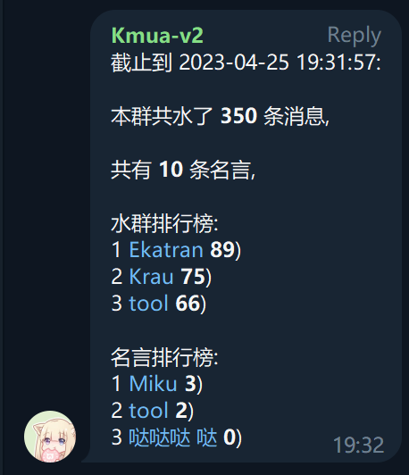

# 功能详解

## 功能一览

- 发言数据统计
- Quote(载入史册)
- 群内文字命令互动
- 获取群头衔/互赠头衔
- 开发中...

## 命令

| 命令   | 说明              |
| ------ | ----------------- |
| /help  | 显示帮助信息      |
| /start | 开始使用          |
| /q     | 载入史册          |
| /d     | 移出史册          |
| /c     | 清空史册          |
| /t     | 获取头衔/互赠头衔 |
| /setqp | 设置发典概率      |
| /rank  | 群统计信息        |

## 数据统计

Kmua 会对自己收到的消息进行记录和统计, 每个群聊(Chat)和用户(User)都会有自己的数据

在群内发送 /rank 可获取当前的统计信息

私聊 Kmua 可获取自己的数据统计信息

## Quote

使用 `/q` 回复一条消息, Kmua 将会把这条消息置顶记录到一个列表中, 每个群聊之间的列表相互独立

如果这条消息属于文字消息, Kmua 将会生成一张图片, 示例如下(右下角是用户名,此处被码掉了)

当收到新消息时, Kmua 有概率从列表中随机选择一条被记录的消息, 并转发

这个概率可以通过 `/setqp` 来设置, 默认为 0.1 , 范围是 [0,1] 的小数